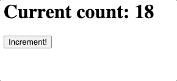

# fastapi-faust-example
A quick POC for integrating [FastAPI](https://fastapi.tiangolo.com/) and [Faust](https://faust.readthedocs.io/en/latest/).

This project implements a simple incrementer web app. See the `.gif` file below.

---

---

## Basic Architecture
- We use [Docker Compose](https://docs.docker.com/compose/) to set up 4 containers:
    - api
    - worker
    - kafka
    - zookeeper
- The `worker` container is based on a custom docker image that has both [Python](https://www.python.org/) and [RocksDB](https://rocksdb.org/) installed already. To see how RocksDB is used in Faust, see [here](https://faust.readthedocs.io/en/latest/userguide/application.html#application-parameters).
- In the `worker` container, we define a [GlobalTable](https://faust.readthedocs.io/en/latest/reference/faust.app.html#faust.app.App.GlobalTable) to hold the current count for the incrementer.
- Both the `worker` and `api` containers each have their own Faust app instance. However, the `api` Faust instance is started in "client-only" mode (i.e. just a producer and simple reply consumer).
- When the user visits the webpage in their browser, the following happens:
    - The browser makes a `GET` request to the API.
    - The API asks a Faust agent to retrieve the current incrementer count value.
    - Once the API gets this value, it responds to the browser with HTML that includes the current count.
- When the user clicks the `Increment` button in their browser, the following happens:
    - A `POST` request is sent to the API.
    - The API then asks a Faust agent to increment the count value.
    - Once the value is incremented, the API responds to the browser with a "redirect" response.
    - The browser then redirects back to the original page, which displays the updated count value.

## Running the app locally
- Install [Docker](https://docs.docker.com/get-docker/) on your machine.
- `git clone` this repo.
- `cd` into this repo, and run `docker-compose up --build`.
- Open your web browser, and visit http://localhost:8000/
- To stop running the app, go into the terminal, and press `Ctrl + C`. Then, run `docker-compose down`.
